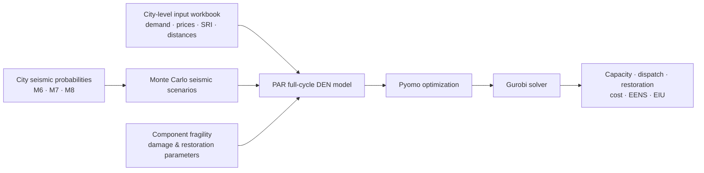

# Spatiotemporal full-cycle optimal design enhances seismic resilience of distributed energy networks

[](https://github.com/d2dmh/SeismicResilienceDEN/actions/workflows/repository-integrity.yml)


This repository accompanies the manuscript **“Spatiotemporal full-cycle optimal design enhances seismic resilience of distributed energy networks.”** It contains the model implementation and six-city input dataset used to study distributed energy network (DEN) resilience under stochastic seismic disruption.

The framework integrates **pre-hazard prevention**, **in-hazard adaptation**, and **post-hazard restoration** (PAR) within a stochastic multi-energy optimization model solved with Pyomo and Gurobi.

## Repository guide

| If you want to… | Start here |
|---|---|
| run the optimization model | [`code/full_cycle_model.ipynb`](code/full_cycle_model.ipynb) |
| understand the notebook structure | [`code/README.md`](code/README.md) |
| inspect city input files | [`data/`](data/) |
| understand every worksheet/field | [`docs/DATA_DICTIONARY.md`](docs/DATA_DICTIONARY.md) |
| inspect seismic occurrence probabilities | [`config/seismic_probabilities.csv`](config/seismic_probabilities.csv) |
| understand model formulation and implementation | [`docs/MODEL_DESCRIPTION.md`](docs/MODEL_DESCRIPTION.md) |
| reproduce a model run | [`docs/REPRODUCTION.md`](docs/REPRODUCTION.md) |
| check repository structure | `python -m unittest discover -s tests -v` |

## Computational workflow



## Study cases

The dataset covers six representative urban districts spanning northern/southern climatic conditions and high/medium/low seismic-risk groups.

| City | Climate group | Seismic-risk group | M6 | M7 | M8 |
|---|---|---|---:|---:|---:|
| Beijing | North | Medium | 0.015274137 | 0.002311834 | 0.000349910 |
| Fuzhou | South | Medium | 0.006500000 | 0.000800000 | 0.000400000 |
| Harbin | North | Low | 0.010600000 | 0.000100000 | 0.000030300 |
| Pu'er | South | Low | 0.000222626 | 0.000037807 | 0.000007500 |
| Wuhan | South | High | 0.048260000 | 0.006817000 | 0.000960000 |
| Xi'an | North | High | 0.069747010 | 0.011575122 | 0.001920992 |

`M6`, `M7`, and `M8` are city-level annual seismic occurrence probabilities used by the optimization model. The Supplementary Information describes the upstream CPSHA procedure based on the GB18306-2015 China Seismic Parameter Zoning Map, including a truncated Gutenberg–Richter magnitude model, a Poisson occurrence model, and PGA estimation. The region-specific coefficients required to independently regenerate all six probability triplets are not part of the current repository, so these probabilities are treated as input data.

## Repository structure

```text
SeismicResilienceDEN/
├── README.md
├── requirements.txt
├── CITATION.cff
├── code/
│   ├── README.md
│   └── full_cycle_model.ipynb
├── config/
│   ├── README.md
│   └── seismic_probabilities.csv
├── data/
│   ├── README.md
│   ├── DATA_MANIFEST.csv
│   ├── beijing/model_data.xlsx
│   ├── fuzhou/model_data.xlsx
│   ├── harbin/model_data.xlsx
│   ├── puer/model_data.xlsx
│   ├── wuhan/model_data.xlsx
│   └── xian/model_data.xlsx
├── docs/
│   ├── DATA_DICTIONARY.md
│   ├── MODEL_DESCRIPTION.md
│   └── REPRODUCTION.md
├── results/
│   ├── README.md
│   └── .gitkeep
├── tests/
│   └── test_repository_integrity.py
└── .github/workflows/
    └── repository-integrity.yml
```

## Quick start

### 1. Create the Python environment

Python 3.10+ is recommended.

```bash
python -m venv .venv
pip install -r requirements.txt
```

A local **Gurobi installation and valid Gurobi license** are required for optimization runs.

### 2. Open the model

From the repository root:

```bash
jupyter lab
```

Open:

```text
code/full_cycle_model.ipynb
```

The first configuration cell contains the main user controls:

```python
CITY = "harbin"      # beijing | fuzhou | harbin | puer | wuhan | xian
N_MONTE_CARLO = 1000
RANDOM_SEED = None
```

For a quick **smoke test**, temporarily use a small Monte Carlo count such as `N_MONTE_CARLO = 1` or `5`. The study-scale configuration uses `1000` realizations.

### 3. Run the notebook

The selected city workbook and seismic probabilities are resolved automatically from `data/` and `config/seismic_probabilities.csv`.

See [`docs/REPRODUCTION.md`](docs/REPRODUCTION.md) for solver settings, runtime notes, output objects, and recommended publication-level validation.

## Input data

Every city workbook contains the same seven worksheets:

| Sheet | Shape including headers | Model role |
|---|---:|---|
| `dist` | 7 × 7 | pairwise building distances / network input |
| `qty_day` | 7 × 7 | representative-period multiplicities |
| `e_dem` | 37 × 170 | electricity demand: 6 buildings × 6 scenarios × 168 h |
| `c_dem` | 37 × 170 | cooling demand: 6 buildings × 6 scenarios × 168 h |
| `h_dem` | 37 × 170 | heating demand: 6 buildings × 6 scenarios × 168 h |
| `price` | 5 × 169 | electricity and natural-gas price profiles |
| `SRI` | 7 × 169 | solar radiation index profiles |

A compact file inventory is provided in [`data/DATA_MANIFEST.csv`](data/DATA_MANIFEST.csv). Detailed field definitions, indexing, units where documented, and Pyomo mappings are provided in [`data/README.md`](data/README.md) and [`docs/DATA_DICTIONARY.md`](docs/DATA_DICTIONARY.md).

## Model scope

The public model currently represents:

- six representative buildings (`b1`–`b6`);
- 168 hourly time steps (`h1`–`h168`) per representative profile;
- climate conditions `sum`, `win`, and `mid`;
- seismic conditions `M6`, `M7`, and `M8`;
- CHP, boiler, electric chiller, absorption chiller, heat pump, battery, cooling storage, utility grid, PV, and heating/cooling networks;
- technology-specific seismic fragility;
- stochastic earthquake onset and component failure states;
- electricity, heating, and cooling load shedding;
- component/network restoration decisions and restoration costs;
- annualized cost, EENS, EIU, capacities, dispatch, and network flows.

The objective combines device and pipe capital costs, fuel cost, maintenance cost, net grid cost, unmet-demand cost, and restoration cost. See [`docs/MODEL_DESCRIPTION.md`](docs/MODEL_DESCRIPTION.md) for the equation-to-code mapping.

## Outputs

During the Monte Carlo solve loop, results are retained in Pyomo mutable parameters with the prefix `m.ag_*`. These include total cost, cost components, EENS/EIU, technology capacities, hourly dispatch, network flows, and restoration-related values.

The current notebook does **not** automatically export a manuscript-ready CSV/Excel result package. The [`results/`](results/) directory is reserved for versioned, author-validated exports or benchmark outputs.

## Quick validation

Repository integrity can be checked without a Gurobi license:

```bash
python -m unittest discover -s tests -v
```

The test suite checks:

- six-city data availability and workbook sheet names;
- seismic-probability configuration values;
- notebook syntax and repository-relative configuration;
- required documentation and public file organization.

The same structural check is run automatically by GitHub Actions. It does **not** solve the optimization model or establish numerical agreement with manuscript figures.

## Reproducibility status

This repository is currently a **pre-publication code and input-data release**. The model entry point and data organization are complete enough for author review and computational inspection. Before a final archival release, the authors should freeze one validated reference run, confirm the final software environment, and add the manuscript DOI/citation metadata.

## Citation

Citation metadata are provided in [`CITATION.cff`](CITATION.cff). Final journal citation and DOI information should be added when available.

## License

A software/data license has not yet been specified by the project authors. The license should be selected before the final public archival release.
